# Julia Plots Gallery

This site is an unofficial Plots.jl Gallery site. It is inspired by [MATLAB Plot Gallery](https://jp.mathworks.com/products/matlab/plot-gallery.html).

Figures are drawed by [Plots.jl](https://github.com/JuliaPlots/Plots.jl) with GR backend except for two y axis plot.

## Environment
- Julia version 0.6.2
- Plots.jl version 0.14.2

```julia
using Plots
gr()
```

## Standard plots

|line plot (1)| line plot (2)| date time plot | function plot|
| ---- | ---- | ---- | ---- |
| 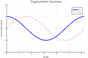 | 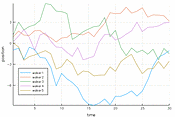 | 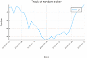 | 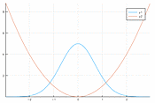 |
|[View source](src/line_plot1.md)|[View source](src/line_plot2.md)|[View source](src/datetime_plot1.md)|[View source](src/function1.md)|

<br>

|implicit function | parametric 2d | parametric 3d | 
| ---- | ---- | ---- |
|  | 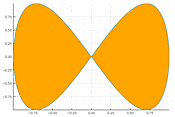 | 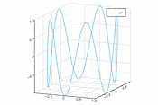 | 
|[View source](src/implicit.md)|[View source](src/parametric2d.md)|[View source](src/parametric3d.md)|

<br>

| semilog x | semilog y | log-log | 
| ---- | ---- | ---- |
| 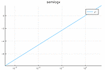 | 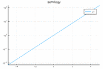 | 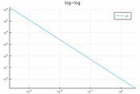 | 
|[View source](src/semilogx.md)| [View source](src/semilogy.md)| [View source](src/loglog.md)|

<br>

| bar side by side | stacked bar | horizontal bar| histogram |
|----|----|----|----|
| 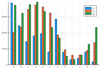 | 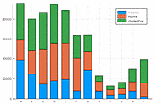 | 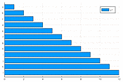| |
| [View source](src/bardodge.md)|[View source](src/barstacked.md)| [View source](src/barhorizontal.md)| [View source](src/histogram.md) |

<br>

| Categorical histogram plot | heatmap chart | pie | contour plot |
|----|----|----|----|
| 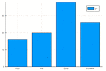 | 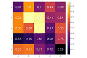 | 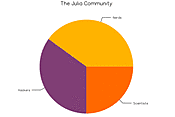 | 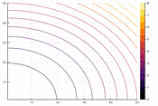 |
| [View source](src/Categoricalhistogramplot.md) | [View source](src/heatmapchart.md) | [View source](src/pie.md) | [View source](src/contourplot.md) |

<br>

| Function Contour plot | polar plots | rose plot | scatter plot 2d |
|----|----|----|----|
| 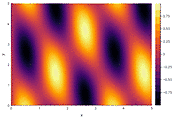 | 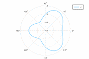 | 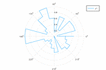 | 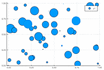 |
| [View source](src/rncontour.md) | [View source](src/polar.md) | [View source](src/rose.md) | [View source](src/scatter2d.md) |

<br>

| scatter plot 3d | stem plot | step plot | error bar |
|----|----|----|----|
| 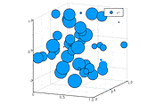 |  | 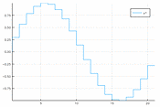 | 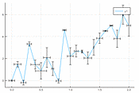 |
| [View source](src/scatter3d.md) | [View source](src/stem.md) | [View source](src/step.md) | [View source](src/errorbar.md) |

<br>

| Two Y axis | subplot 1 | subplot 3 | subplot 3 |
|----|----|----|----|
| 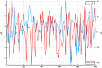 | 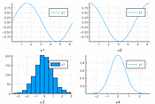 | 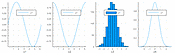 | 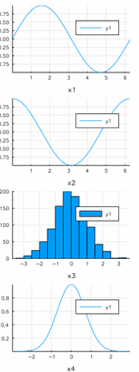 |
| [View source](src/twoyaxis.md) | [View source](src/subplot1.md) | [View source](src/subplot2.md) | [View source](src/subplot3.md) |

<br>

| Quiver 2d | Surface | Mesh |
|----|----|----|
| 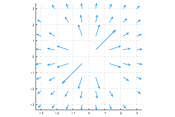 | 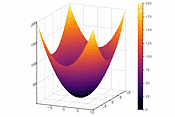 | 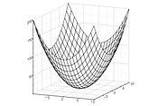 |
| [View source](src/quiver2d.md) | [View source](src/surface.md) | [View source](src/mesh.md) | 


## Customizing Plots

| Standard Line Colors | Standard Line Styles | Standard Plot Markers | Adding Latex to Plots |
|----|----|----|----|
| 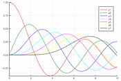 | 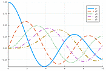 | 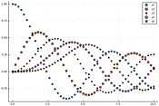 | 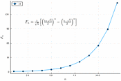 |
| [View source](src/colorplot.md) | [View source](src/linestyle.md) | [View source](src/markertypes.md) | [View source](src/latex.md) |

<br>

| Axis | Font |
|----|----|
| 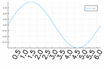 | 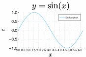 |
| [View source](src/axis.md) | [View source](src/font.md) |
