# Plots Gallery

This site is an unofficial Plots.jl Gallery site. It is inspired by [MATLAB Plot Gallery](https://jp.mathworks.com/products/matlab/plot-gallery.html).

Figures are ploted by [Plots.jl](https://github.com/JuliaPlots/Plots.jl).

## Tested Environment
- Julia 1.7.0
- Plots 1.25.1
- PyPlot 2.10.0
- GR 0.62.1

For all plots, you should import Plots.
```julia
using Plots
```


|  Line Plot 2D 1 | Line Plot 2D 2 | Datetime Plot | Simple Fn |
|  ---- | ---- | ---- | ---- |
| 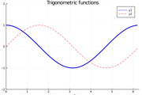 |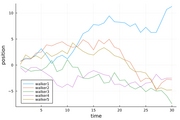 |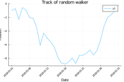 |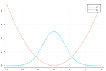 |
| [View source](src/line_plot_2d_1.md) |[View source](src/line_plot_2d_2.md) |[View source](src/datetime_plot.md) |[View source](src/simple_fn.md) |

<br>

|  Parametric2D | Parametric3D | Semilogy | Semilogx |
|  ---- | ---- | ---- | ---- |
|  |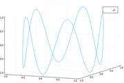 |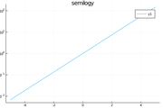 |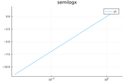 |
| [View source](src/parametric2d.md) |[View source](src/parametric3d.md) |[View source](src/semilogy.md) |[View source](src/semilogx.md) |

<br>

|  Loglog | Vertical Bar Plot | Stacked Bar Plot | Horizontal Bar Plot |
|  ---- | ---- | ---- | ---- |
| 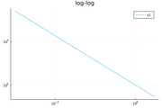 |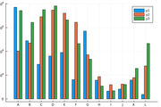 |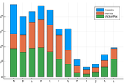 |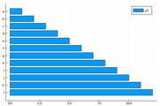 |
| [View source](src/loglog.md) |[View source](src/vertical_bar_plot.md) |[View source](src/stacked_bar_plot.md) |[View source](src/horizontal_bar_plot.md) |

<br>

|  Histogram Plot | Categorical Histogram Plot | Histogram 2D | Boxplot |
|  ---- | ---- | ---- | ---- |
| 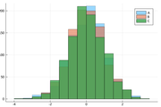 |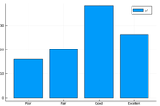 |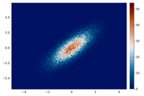 |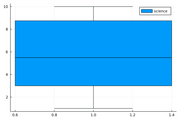 |
| [View source](src/histogram_plot.md) |[View source](src/categorical_histogram_plot.md) |[View source](src/histogram_2d.md) |[View source](src/boxplot.md) |

<br>

|  Boxplot2 | Heatmap | Pie | Contour Plot |
|  ---- | ---- | ---- | ---- |
| 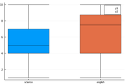 |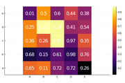 |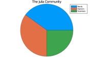 |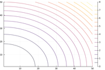 |
| [View source](src/boxplot2.md) |[View source](src/heatmap.md) |[View source](src/pie.md) |[View source](src/contour_plot.md) |

<br>

|  Fn Contour Plot | Polar | Rose | Scatter2D |
|  ---- | ---- | ---- | ---- |
| 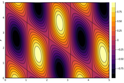 |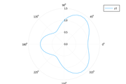 | |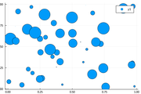 |
| [View source](src/fn_contour_plot.md) |[View source](src/polar.md) |[View source](src/rose.md) |[View source](src/scatter2d.md) |

<br>

|  Scatter3D | Stem | Stairstep | Error Bar |
|  ---- | ---- | ---- | ---- |
| 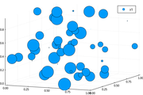 |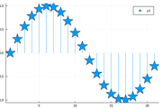 |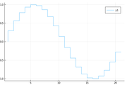 |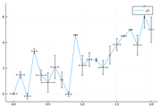 |
| [View source](src/scatter3d.md) |[View source](src/stem.md) |[View source](src/stairstep.md) |[View source](src/error_bar.md) |

<br>

|  Two Y Axis | Subplot1 | Subplot2 | Subplot3 |
|  ---- | ---- | ---- | ---- |
| 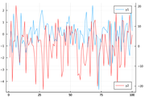 |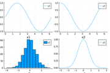 |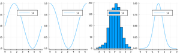 |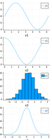 |
| [View source](src/two_y_axis.md) |[View source](src/subplot1.md) |[View source](src/subplot2.md) |[View source](src/subplot3.md) |

<br>

|  Quiver | Surface | Surface2 | Surface3 |
|  ---- | ---- | ---- | ---- |
| 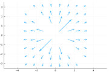 |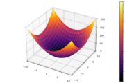 |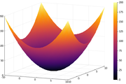 |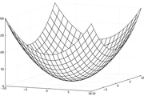 |
| [View source](src/quiver.md) |[View source](src/surface.md) |[View source](src/surface2.md) |[View source](src/surface3.md) |

<br>

|  Standard Line Colors | Line Style | Latex1 | Latex2 |
|  ---- | ---- | ---- | ---- |
| 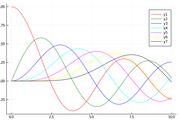 |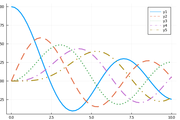 |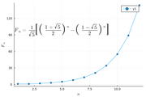 |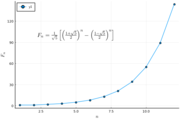 |
| [View source](src/standard_line_colors.md) |[View source](src/line_style.md) |[View source](src/latex1.md) |[View source](src/latex2.md) |

<br>

|  Axis | No Axis | Ticks | Formatter |
|  ---- | ---- | ---- | ---- |
| 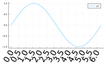 |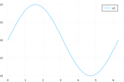 |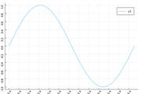 |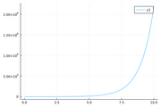 |
| [View source](src/axis.md) |[View source](src/no_axis.md) |[View source](src/ticks.md) |[View source](src/formatter.md) |

<br>

|  Axis Range | Aspect Ratio | Axis Flip | Font |
|  ---- | ---- | ---- | ---- |
| 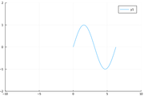 |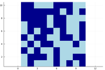 | |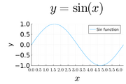 |
| [View source](src/axis_range.md) |[View source](src/aspect_ratio.md) |[View source](src/axis_flip.md) |[View source](src/font.md) |

<br>

