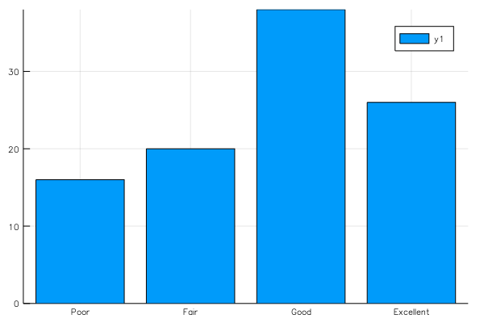

# Categorical histogram plot



```julia
using StatsBase

srand(2018)
s = ["Poor", "Fair", "Good", "Excellent"]
data = sample(s, Weights([1,1,2,2]), 100)
datamap = countmap(data)
bar((x -> datamap[x]).(s), xticks=(1:4, s))
```

ref: https://jp.mathworks.com/matlabcentral/fileexchange/63452-matlab-plot-gallery-categorical-histogram-plot?focused=7852078&tab=example
