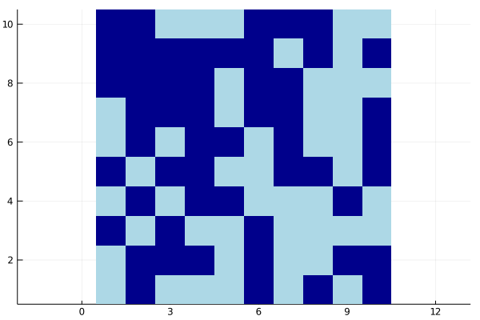

### Aspect ratio



```julia
s = bitrand(10, 10)
heatmap(s,
        aspect_ratio=:equal,
        c=:blues,
        colorbar=false)
```

---

*This page was generated using [Literate.jl](https://github.com/fredrikekre/Literate.jl).*

