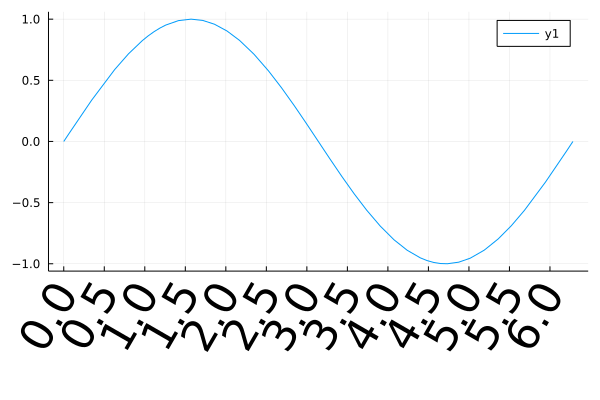

## Axis
### axis



```julia
using Measures
gr()

plot(sin, 0, 2π,
    xticks=0:0.5:2π,
    xrotation=60,
    xtickfont=font(30),
    bottom_margin=15mm)
```

---

*This page was generated using [Literate.jl](https://github.com/fredrikekre/Literate.jl).*

