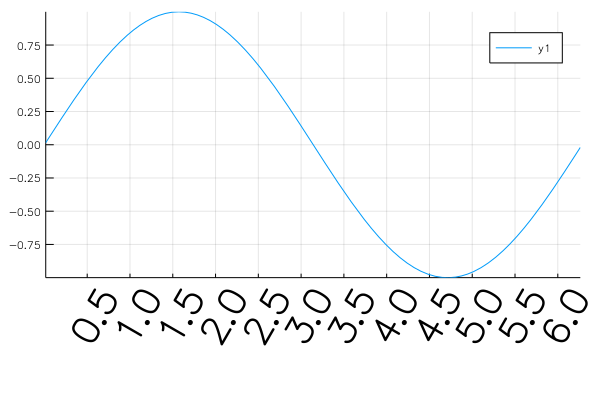
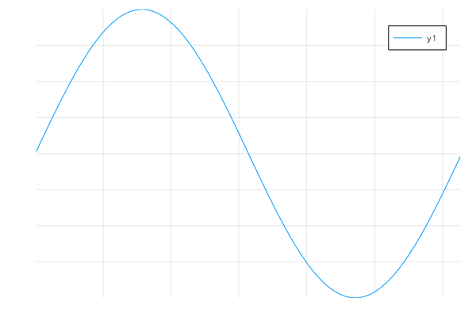
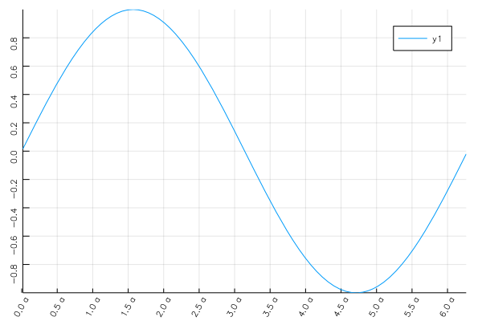
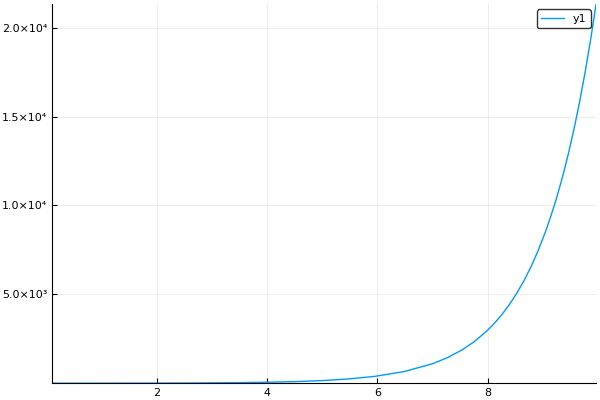
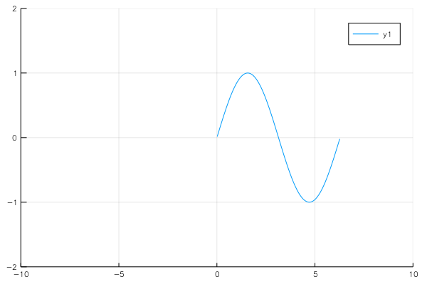
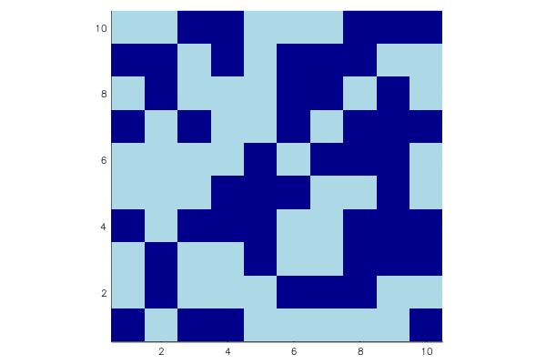

# Axis



```julia
using LaTeXStrings, Measures
gr()

plot(sin, 0, 2π,
    xticks=0:0.5:2π,
    xrotation=60,
    xtickfont=font(30),
    
    bottom_margin=15mm
    )
```

## No axis


```julia
plot(sin, 0, 2π, axis=false)
```

## ticks


```julia
plot(sin, 0, 2π,
    xtick=(0:0.5:2π, ["$i a" for i in 0:0.5:2π]),
    ytick=-1:0.2:1,
    xrotation=60, # -> rotate xticks 60 degree
    yrotation=90,
#     rotation=60, # x,y ticks rotation
    )
```

## formatter


```julia
pyplot()
plot(exp, 0, 10, 
    yformatter=:scientific)
```


## axis range


```julia
plot(sin, 0, 2π, xlims=(-10, 10), ylims=(-2,2))
```

## Aspect ratio


```julia
s = bitrand(10, 10)
heatmap(s, 
    aspect_ratio=:equal, 
    c=:blues,
    colorbar=false)
```
