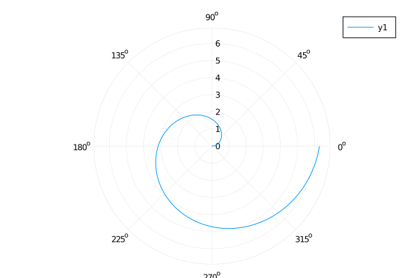

### axis flip



```julia
plot(x->x, 0:0.01:2π,
    proj=:polar,
    xflip=true,
    yflip=true,
    # flip=true # x,y-flip
)
```

---

*This page was generated using [Literate.jl](https://github.com/fredrikekre/Literate.jl).*

