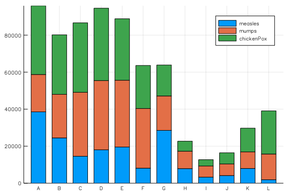

# stacked bar

ref: https://jp.mathworks.com/matlabcentral/fileexchange/35271-matlab-plot-gallery-vertical-bar-plot?focused=6793087&tab=example



```julia
using StatPlots
gr()

measles = [38556, 24472, 14556, 18060, 19549, 8122, 28541, 7880, 3283, 4135, 7953, 1884]
mumps = [20178, 23536, 34561, 37395, 36072, 32237, 18597, 9408, 6005, 6268, 8963, 13882]
chickenPox = [37140, 32169, 37533, 39103, 33244, 23269, 16737, 5411, 3435, 6052, 12825, 23332]

groupedbar([measles mumps chickenPox], 
        bar_position = :stack, 
        bar_width=0.7, 
        xticks=(1:12, 'A':'L'),
        label=["measles", "mumps", "chickenPox"])
```
