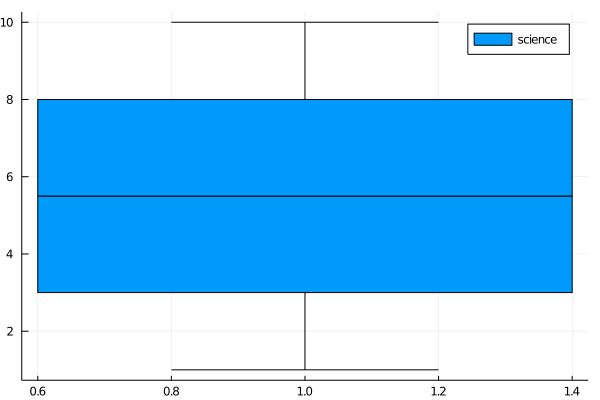

## Box plot
### Box plot (1)



```julia
using StatsPlots, Statistics, Random
Random.seed!(2018)

n = 30
science = rand(1:10, n)
@show median(science)
boxplot(science, label=permutedims(["science"]))
```

---

*This page was generated using [Literate.jl](https://github.com/fredrikekre/Literate.jl).*

