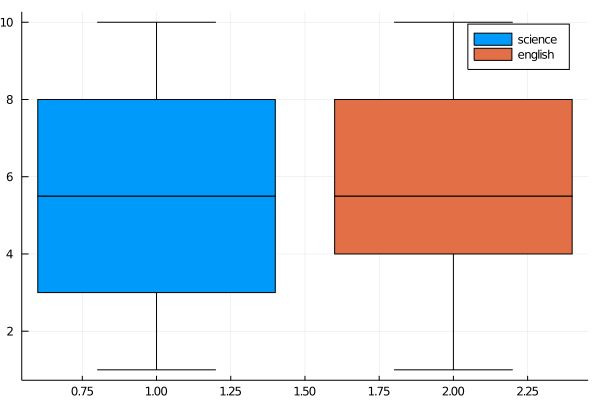

## Box plot (2)



```julia
# This outputs BoundsError. This is a bug of StatPlots.jl.
# Boxplot and violin broken - https://github.com/JuliaPlots/StatPlots.jl/issues/198
using StatsPlots, Statistics
Random.seed!(2018)

n = 30
science = rand(1:10, n)
english = rand(1:10, n)

@show median(science)
@show median(english)

boxplot(["science" "english"], [science english])
```

---

*This page was generated using [Literate.jl](https://github.com/fredrikekre/Literate.jl).*

