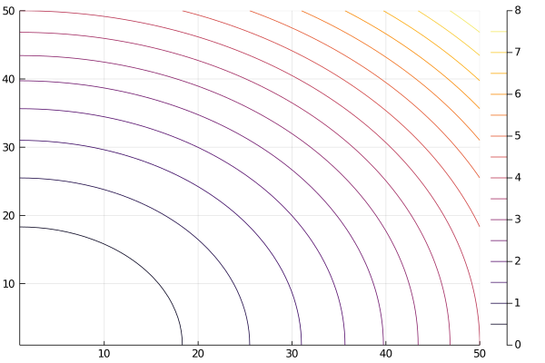

## Contour plot
### Contour plot



```julia
f(x,y) = x^2 + y^2
x = repeat(range(0, stop=2, length=50), 1, 50)
y = repeat(range(0, stop=2, length=50), 1, 50)'

contour( f.(x, y) )
```

---

*This page was generated using [Literate.jl](https://github.com/fredrikekre/Literate.jl).*

