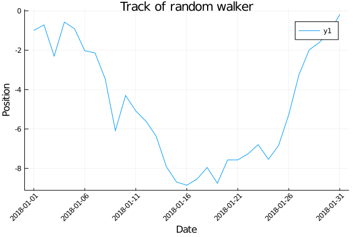

## Datetime plot
https://github.com/JuliaPlots/Plots.jl/issues/356



```julia
using Measures, Random, Dates

Random.seed!(2018)
days = 31
position = cumsum(randn(days))
x = Date(2018,1,1):Day(1):Date(2018,1,31)
ticks = [x[i] for i in 1:5:length(x)]

plot(x, position,
    xlabel="Date",
    ylabel="Position",
    title="Track of random walker",
    xticks=ticks,
    xrotation=45,
    bottom_margin=15mm,
    left_margin=5mm)
```

---

*This page was generated using [Literate.jl](https://github.com/fredrikekre/Literate.jl).*

