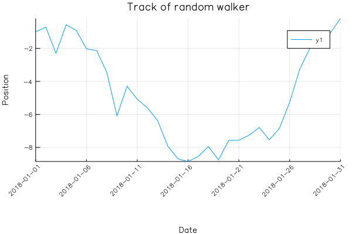

# date time plot

ref: https://github.com/JuliaPlots/Plots.jl/issues/356



```julia
using Measures

srand(2018)
days = 31
position = cumsum(randn(days))
x = Date(2018,1,1):Date(2018,1,31)
ticks = [x[i] for i in 1:5:length(x)]

plot(x, position,
    xlabel="Date",
    ylabel="Position",
    title="Track of random walker",
    xticks=ticks, 
    xrotation=45, 
    bottom_margin=15mm,
    left_margin=5mm)
```
