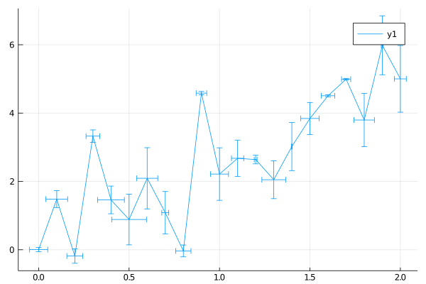

## Error bar



```julia
Random.seed!(2018)

f(x) = 2 * x + 1
x = 0:0.1:2
n = length(x)
y = f.(x) + randn(n)
plot(x, y,
    xerr=0.1 * rand(n),
    yerr=rand(n))
```

---

*This page was generated using [Literate.jl](https://github.com/fredrikekre/Literate.jl).*

