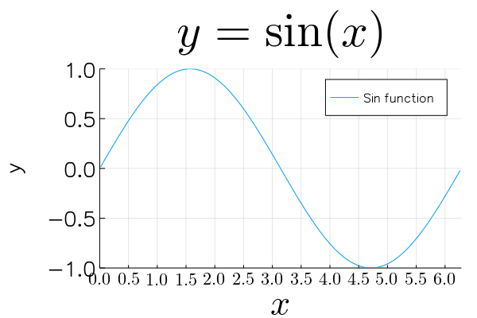

# Font



```julia
using Measures, LaTeXStrings

plot(sin, 0, 2π,
    title=L"y = \sin(x)",
    titlefont=font(40), # title
    
    xlabel=L"x",
    ylabel="y",
    xguidefont=font(30), # x-label
    yguidefont=font(20), # x-label
#     guidefont=font(20), # x,y-label
    
    xtick=(0:0.5:2π, ["\$ $(i) \$" for i in 0:0.5:2π]),
    ytick=-1:0.5:1,
    xtickfont=font(15),
    ytickfont=font(20),
#     tickfont=font(10), # x,y-ticks font
    
    label="Sin function",
    legendfont=font(12),
    
    
    xlims=(0,2π),
    ylims=(-1,1),
    bottom_margin=5mm,
    left_margin=10mm,
    top_margin=15mm
)
```
