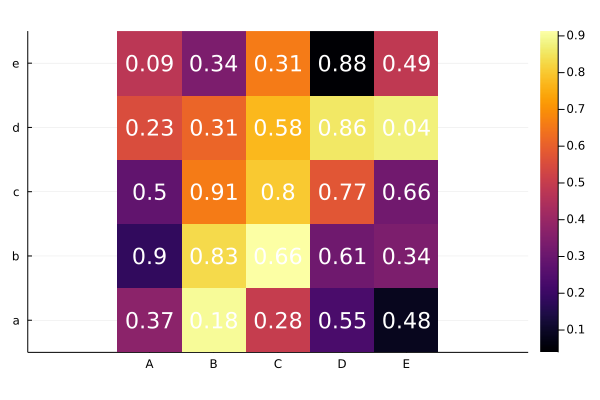

## Heatmap



````julia
using Random
Random.seed!(2018)

a = rand(5,5)
xlabel = string.(collect('A':'E'))
ylabel = string.(collect('a':'e'))
heatmap(a, xticks=(1:5, xlabel), yticks=(1:5, ylabel),
    fill_z=a, aspect_ratio=:equal)

fontsize = 15
nrow, ncol = size(a)
ann = [(i,j, text(round(a[i,j], digits=2), fontsize, :white, :center))
            for i in 1:nrow for j in 1:ncol]
annotate!(ann, linecolor=:white)
````

---

*This page was generated using [Literate.jl](https://github.com/fredrikekre/Literate.jl).*

