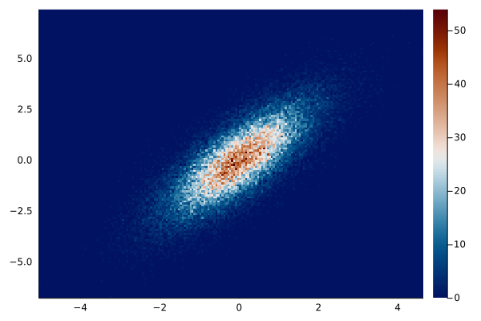

### Hisogram plot 2d



````julia
x = randn(50000);
y = x * 1.2 + randn(50000);

plot(
    x,
    y,
    seriestype = :histogram2d,
    c = :vik,
    nbins = 200,
    show_empty_bins = :true
)

# equivalent
# histogram2d(
#     x,
#     y,
#     c = :vik,
#     nbins = 200,
#     show_empty_bins = :true
# )
````

---

*This page was generated using [Literate.jl](https://github.com/fredrikekre/Literate.jl).*

