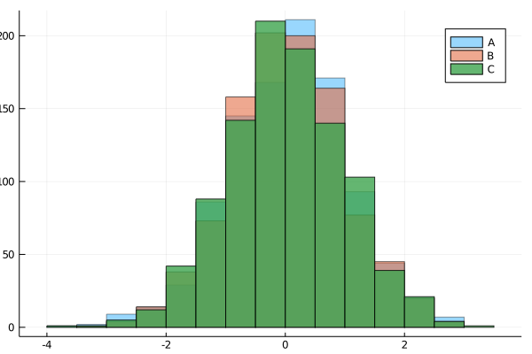

## Histogram Plot
### Histogram Plot



```julia
Random.seed!(2018)

x = randn(1000)
y = randn(1000)
z = randn(1000)

histogram(x, bins=20, alpha=0.4, label="A")
histogram!(y, bins=20, alpha=0.6, label="B")
histogram!(z, bins=20, alpha=0.8, label="C")
```

---

*This page was generated using [Literate.jl](https://github.com/fredrikekre/Literate.jl).*

