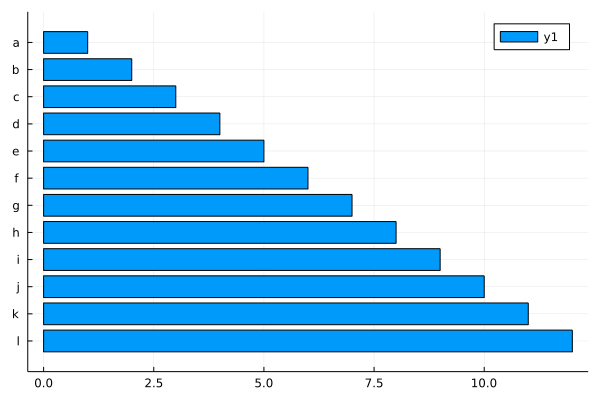

### Horizontal Bar Plot



````julia
ticklabel = string.(collect('a':'l'))
bar(1:12, orientation=:h, yticks=(1:12, ticklabel), yflip=true)
````

---

*This page was generated using [Literate.jl](https://github.com/fredrikekre/Literate.jl).*

