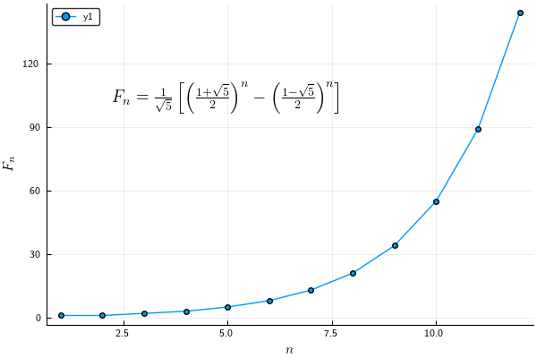

# Adding Latex to Plots



```julia
using LaTeXStrings, Measures

fib = zeros(12);
for i = 1:12
    fib[i] = (((1+sqrt(5))/2)^i - ((1-sqrt(5))/2)^i)/sqrt(5);
end

plot(fib, 
    marker=:circle, 
    xlabel=L"n",
    ylabel=L"F_n",
    annotation=(5, 100, L"F_n = \frac{1}{\sqrt{5}} \left[\left( \frac{1+\sqrt{5}}{2} \right)^n - \left( \frac{1-\sqrt{5}}{2} \right)^n \right]"))
```


<br>
For pyplot backend

```julia
using LaTeXStrings, Measures
pyplot()
Plots.PyPlot.rc("text",usetex ="true")

fib = zeros(12);
for i = 1:12
    fib[i] = (((1+sqrt(5))/2)^i - ((1-sqrt(5))/2)^i)/sqrt(5);
end

plot(fib, 
    marker=:circle, 
    xlabel=L"n",
    ylabel=L"F_n",
    annotation=(5, 100, L"F_n = \frac{1}{\sqrt{5}} \left[\left( \frac{1+\sqrt{5}}{2} \right)^n - \left( \frac{1-\sqrt{5}}{2} \right)^n \right]"))
```

ref: https://jp.mathworks.com/matlabcentral/fileexchange/35237-matlab-plot-gallery-adding-latex-to-plots?focused=6792946&tab=example
