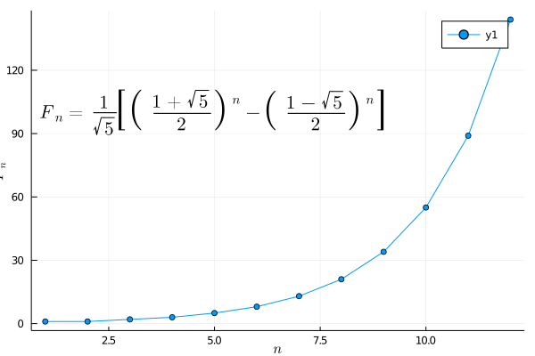

## Adding LaTeX to plots (1)



```julia
# ref https://jp.mathworks.com/matlabcentral/fileexchange/35237-matlab-plot-gallery-adding-latex-to-plots?focused=6792946&tab=example

using LaTeXStrings, Measures
gr()

fib = zeros(12);
for i = 1:12
    fib[i] = (((1+sqrt(5))/2)^i - ((1-sqrt(5))/2)^i)/sqrt(5);
end

plot(fib,
    marker=:circle,
    xlabel=L"n",
    ylabel=L"F_n",
    annotation=(5, 100, L"F_n = \frac{1}{\sqrt{5}} \left[\left( \frac{1+\sqrt{5}}{2} \right)^n - \left( \frac{1-\sqrt{5}}{2} \right)^n \right]"))
```

---

*This page was generated using [Literate.jl](https://github.com/fredrikekre/Literate.jl).*

