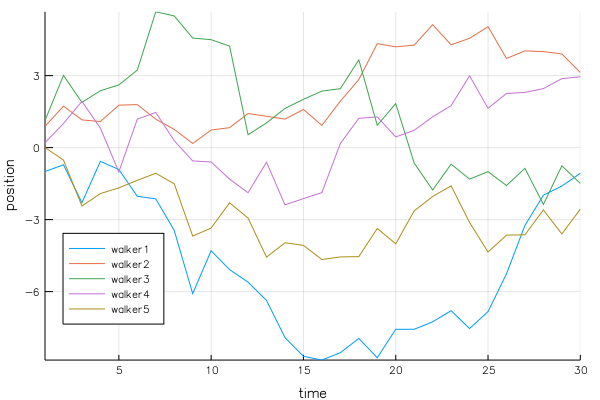

# Line plot 2



```julia
srand(2018)

time = 30
walker1 = cumsum(randn(time))
walker2 = cumsum(randn(time))
walker3 = cumsum(randn(time))
walker4 = cumsum(randn(time))
walker5 = cumsum(randn(time))

plot(1:time, [walker1 walker2 walker3 walker4 walker5],
    xlabel="time",
    ylabel="position",
    label=["walker1" "walker2" "walker3" "walker4" "walker5"],
    leg=:bottomleft)
```
