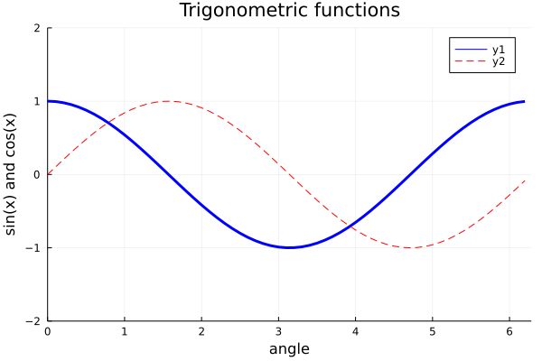

## Line plot 2d



```julia
x = 0:0.1:2pi
y1 = cos.(x)
y2 = sin.(x)

plot(x, y1, c="blue", linewidth=3)
plot!(x, y2, c="red", line=:dash)
title!("Trigonometric functions")
xlabel!("angle")
ylabel!("sin(x) and cos(x)")

# axis limit
plot!(xlims=(0,2pi), ylims=(-2, 2))
```

```julia
# same plot
x = 0:0.1:2pi
y1 = cos.(x)
y2 = sin.(x)

plot(x, y1,
    c="blue",
    linewidth=3,
    title="Trigonometric functions",
    xlabel="angle",
    ylabel="sin(x) and cos(x)")
plot!(x, y2, c="red", line=:dash)

plot!(xlims=(0,2pi), ylims=(-2, 2))
```

---

*This page was generated using [Literate.jl](https://github.com/fredrikekre/Literate.jl).*

