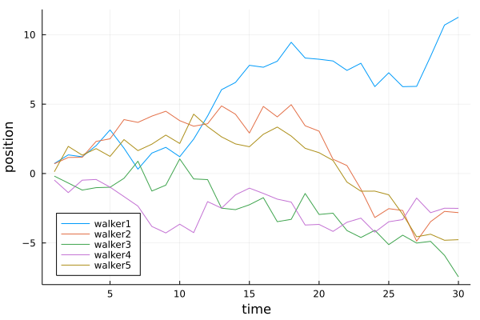

## Line plot 2d (2)



````julia
using Random
Random.seed!(2018)

time = 30
warlker1 = cumsum(randn(time))
warlker2 = cumsum(randn(time))
warlker3 = cumsum(randn(time))
warlker4 = cumsum(randn(time))
warlker5 = cumsum(randn(time))

plot(1:time, [warlker1 warlker2 warlker3 warlker4 warlker5],
    xlabel="time",
    ylabel="position",
    label=["walker1" "walker2" "walker3" "walker4" "walker5"],
    leg=:bottomleft)
````

---

*This page was generated using [Literate.jl](https://github.com/fredrikekre/Literate.jl).*

