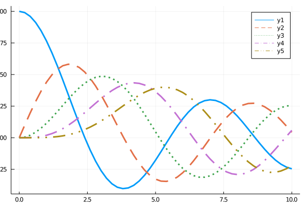

## Line style



```julia
Plots.supported_styles()
```

```julia
# ref https://jp.mathworks.com/matlabcentral/fileexchange/35230-matlab-plot-gallery-standard-line-styles?focused=6792901&tab=example

using SpecialFunctions

style = Plots.supported_styles()[2:end]
style = reshape(style, 1, length(style))
x = 0:0.2:10;
y0 = besselj.(0,x);
y1 = besselj.(1,x);
y2 = besselj.(2,x);
y3 = besselj.(3,x);
y4 = besselj.(4,x);

plot(x, [y0 y1 y2 y3 y4], line=(3, style))
```

---

*This page was generated using [Literate.jl](https://github.com/fredrikekre/Literate.jl).*

