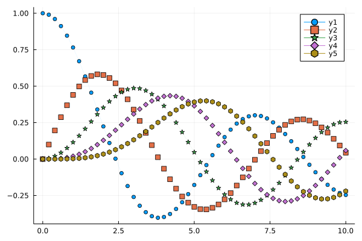

```julia
# Marker style
```



```julia
# ref https://jp.mathworks.com/matlabcentral/fileexchange/35231-matlab-plot-gallery-standard-plot-markers?focused=6792907&tab=example

using SpecialFunctions

x = 0:0.2:10;
y0 = besselj.(0,x);
y1 = besselj.(1,x);
y2 = besselj.(2,x);
y3 = besselj.(3,x);
y4 = besselj.(4,x);

plot(x, [y0 y1 y2 y3 y4],
    marker=[:circle :rect :star5 :diamond :hexagon],
    line=false)
```

```julia
Plots.supported_markers()
```

---

*This page was generated using [Literate.jl](https://github.com/fredrikekre/Literate.jl).*

