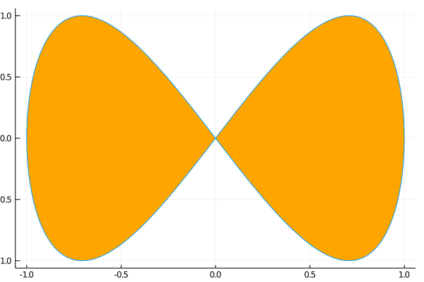

### parametric function plot
http://docs.juliaplots.org/latest/examples/pyplot/



```julia
xₜ(t) = sin(t)
yₜ(t) = sin(2t)

plot(xₜ, yₜ, 0, 2π, leg=false, fill=(0,:orange))
```

---

*This page was generated using [Literate.jl](https://github.com/fredrikekre/Literate.jl).*

