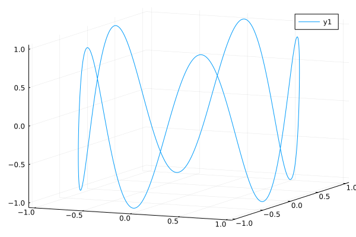

### parametric function plot 3d
https://jp.mathworks.com/matlabcentral/fileexchange/35263-matlab-plot-gallery-function-plot-3d?focused=7851891&tab=example



```julia
t = range(0, stop=10, length=1000)
x = cos.(t)
y = sin.(t)
z = sin.(5t)

plot(x, y, z)
```

---

*This page was generated using [Literate.jl](https://github.com/fredrikekre/Literate.jl).*

