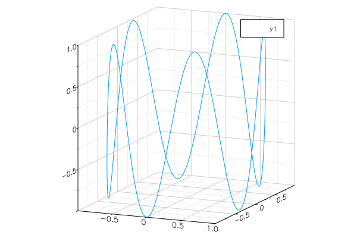

# parametric funciton 3d

ref: https://jp.mathworks.com/matlabcentral/fileexchange/35263-matlab-plot-gallery-function-plot-3d?focused=7851891&tab=example



```julia
t = linspace(0, 10, 1000)
x = cos.(t)
y = sin.(t)
z = sin.(5t)

plot(x, y, z)
```
