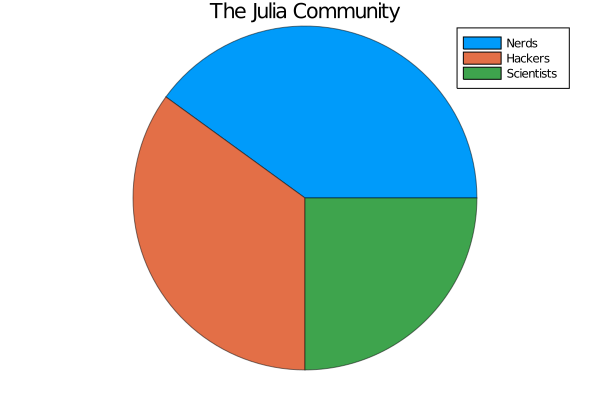

## Pie



```julia
# ref http://docs.juliaplots.org/latest/examples/pyplot/
x = ["Nerds","Hackers","Scientists"]
y = [0.4,0.35,0.25]
pie(x,y,title="The Julia Community",l=21)
```

---

*This page was generated using [Literate.jl](https://github.com/fredrikekre/Literate.jl).*

