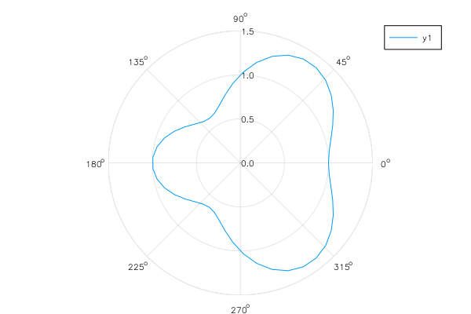

# Polar plot



```julia
r(θ) = 1 + cos(θ) * sin(θ)^2
plot(r, 0, 2π, proj=:polar, lims=(0,1.5))
```

```julia
# same
r(θ) = 1 + cos(θ) * sin(θ)^2
θ = linspace(0, 2π)
plot(θ, r.(θ), proj=:polar, lims=(0,1.5))
```

ref: https://jp.mathworks.com/matlabcentral/fileexchange/35285-matlab-plot-gallery-function-polar-plot?focused=6793167&tab=example
