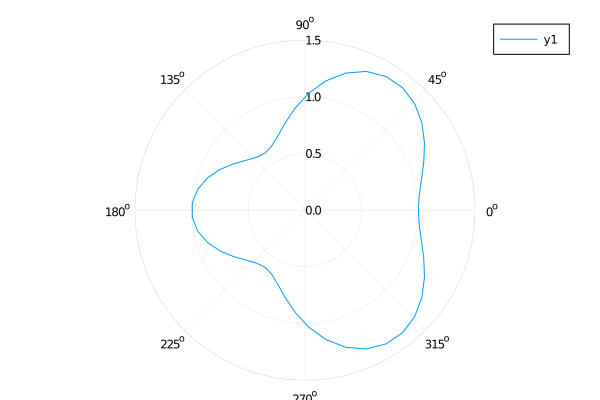

## polar plots



```julia
# ref https://jp.mathworks.com/matlabcentral/fileexchange/35285-matlab-plot-gallery-function-polar-plot?focused=6793167&tab=example
r(θ) = 1 + cos(θ) * sin(θ)^2
plot(r, 0, 2π, proj=:polar, lims=(0,1.5))
```

```julia
r(θ) = 1 + cos(θ) * sin(θ)^2
θ = range(0, stop=2π, length=50)
plot(θ, r.(θ), proj=:polar, lims=(0,1.5))
```

---

*This page was generated using [Literate.jl](https://github.com/fredrikekre/Literate.jl).*

