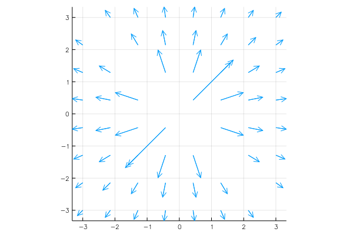

# Quiver 2d



```julia
n = 7
f(x,y) = 1 / hypot(x, y)
x = repmat(-3:(2*3)/n:3, 1, n) |> vec
y = repmat(-3:(2*3)/n:3, 1, n)' |> vec
vx = f.(x,y) .* cos.(atan2.(y,x)) |> vec
vy = f.(x,y) .* sin.(atan2.(y,x)) |> vec

quiver(x, y, quiver=(vx, vy), aspect_ratio=:equal)
```
