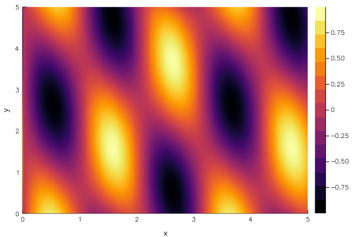

# Function contour plot



```julia
f(x,y) = sin(3x) * cos(x+y)

x = 0:0.01:5
y = 0:0.01:5
contour(x, y, f, xlabel="x", ylabel="y", fill=true)
```

ref: https://jp.mathworks.com/matlabcentral/fileexchange/35283-matlab-plot-gallery-function-contour-plot?focused=7851904&tab=example
