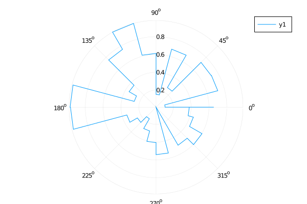

## Rose plot



```julia
using Random
Random.seed!(2018)

n = 24
R = rand(n+1)
θ = 0:2pi/n:2pi
plot(θ, R, proj=:polar, line=:steppre, lims=(0:2))
```

---

*This page was generated using [Literate.jl](https://github.com/fredrikekre/Literate.jl).*

