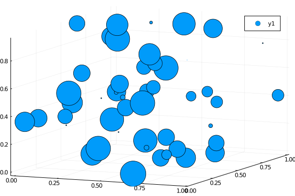

### scatter plot 3d



````julia
using Random
Random.seed!(2018)

n = 50
x = rand(n)
y = rand(n)
z = rand(n)
ms = rand(50) * 30
scatter(x, y, z, markersize=ms)
````

---

*This page was generated using [Literate.jl](https://github.com/fredrikekre/Literate.jl).*

