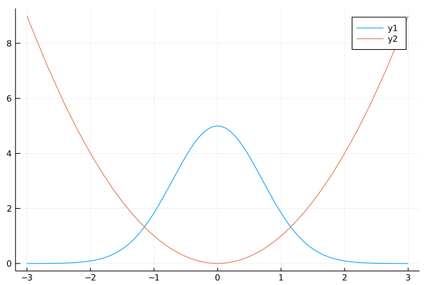

## Function plot
### simple function



```julia
f(x) = 5exp(-x^2)
g(x) = x^2

plot([f, g], -3, 3)
```

---

*This page was generated using [Literate.jl](https://github.com/fredrikekre/Literate.jl).*

