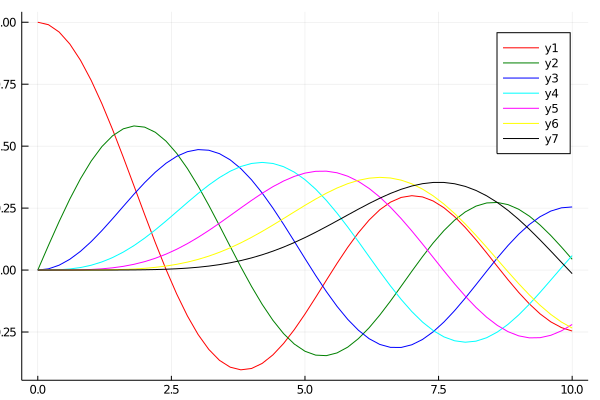

## Standard line colors



```julia
# ref https://jp.mathworks.com/matlabcentral/fileexchange/35229-matlab-plot-gallery-standard-line-colors?focused=6792895&tab=example

using SpecialFunctions

x = 0:0.2:10;
y0 = besselj.(0,x);
y1 = besselj.(1,x);
y2 = besselj.(2,x);
y3 = besselj.(3,x);
y4 = besselj.(4,x);
y5 = besselj.(5,x);
y6 = besselj.(6,x);

plot(x, y0, c=:red)
plot!(x, y1, c=:green)
plot!(x, y2, c=:blue)
plot!(x, y3, c=:cyan)
plot!(x, y4, c=:magenta)
plot!(x, y5, c=:yellow)
plot!(x, y6, c=:black)
```

---

*This page was generated using [Literate.jl](https://github.com/fredrikekre/Literate.jl).*

