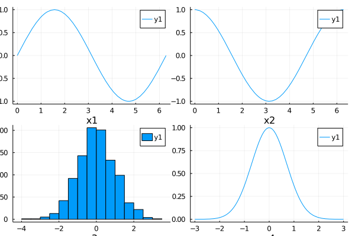

## Subplot
### subplot (1)



```julia
# gr()
a = plot(sin, 0, 2pi, xlabel="x1")
b = plot(cos, 0, 2pi, xlabel="x2")
c = histogram(randn(1000), xlabel="x3")
d = plot(x->exp(-x^2), -3, 3, xlabel="x4")

plot(a, b, c, d)
```

---

*This page was generated using [Literate.jl](https://github.com/fredrikekre/Literate.jl).*

