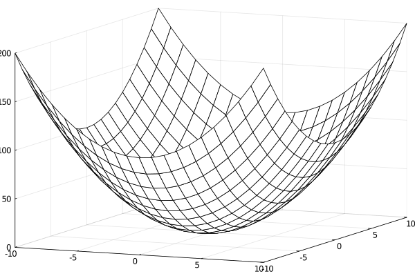

### Surface (3)



````julia
f(x,y) = x^2 + y^2
x = -10:10
y = x
plot(x, y, f, linetype=:wireframe)
````

---

*This page was generated using [Literate.jl](https://github.com/fredrikekre/Literate.jl).*

