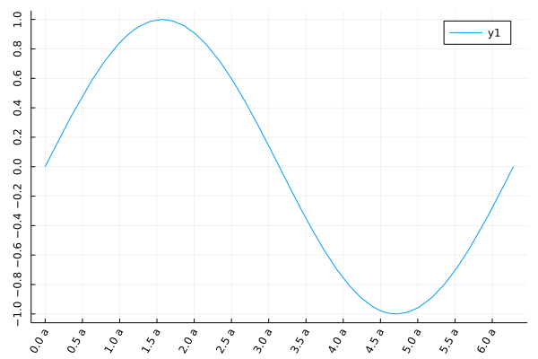

### ticks



```julia
plot(sin, 0, 2π,
    xtick=(0:0.5:2π, ["$i a" for i in 0:0.5:2π]),
    ytick=-1:0.2:1,
    xrotation=60, ## -> rotate xticks 60 degree
    yrotation=90,
    # rotation=60, # x,y ticks rotation
)
```

---

*This page was generated using [Literate.jl](https://github.com/fredrikekre/Literate.jl).*

