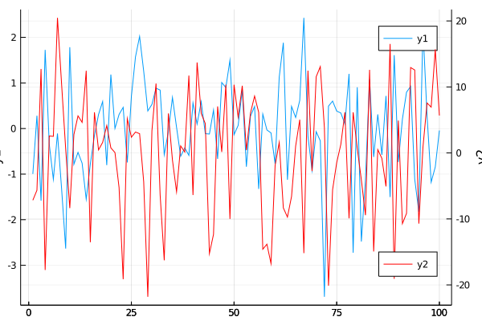

## Two y axis plot



```julia
# pyplot()
using Measures, Random

Random.seed!(2018)
plot(randn(100), ylabel="y1", leg=:topright)
plot!(twinx(), randn(100)*10,
    c=:red,
    ylabel="y2",
    leg=:bottomright,
    size=(600, 400))
plot!(right_bottom=10mm)
```

---

*This page was generated using [Literate.jl](https://github.com/fredrikekre/Literate.jl).*

